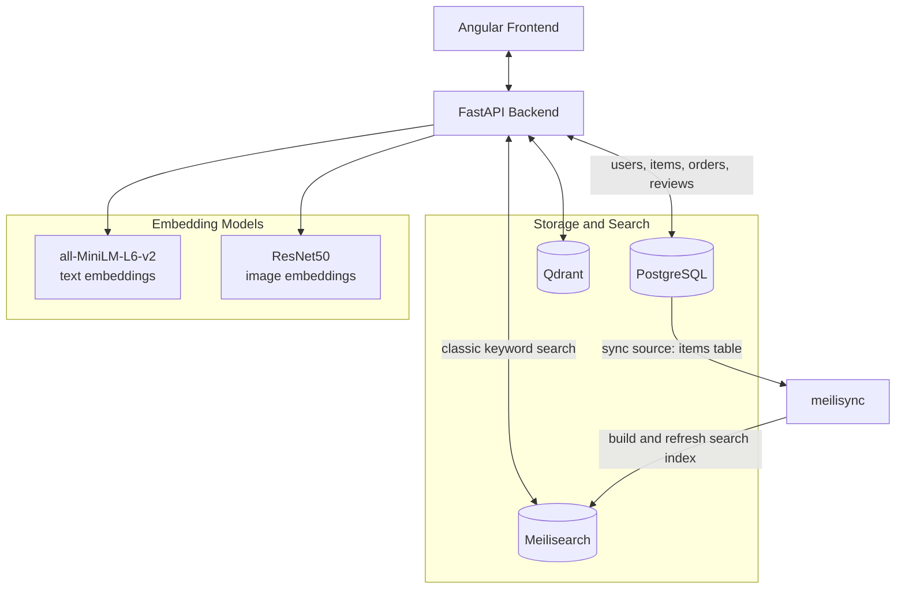
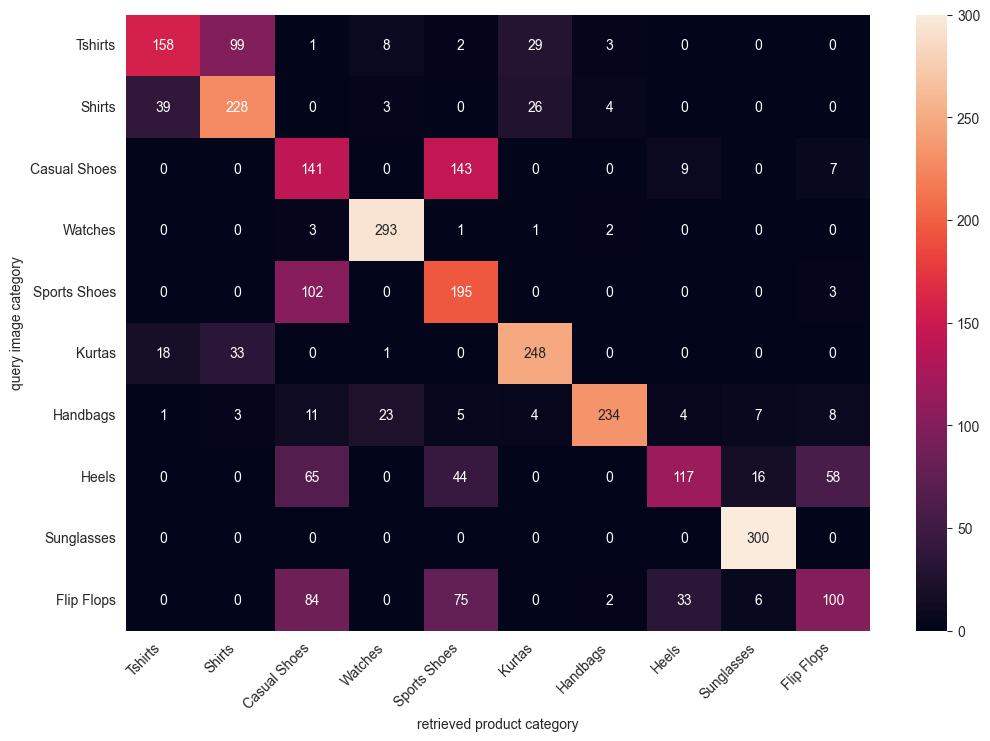

# Semanthica

Semanthica is an end-to-end eCommerce search application built around three retrieval modes: keyword search, semantic text search, and image similarity search. It combines a FastAPI backend, Angular frontend, PostgreSQL as the system of record, Meilisearch for lexical retrieval, and Qdrant for vector search.

The project is centered on a practical product-search problem: keyword matching is often too brittle for real shopping queries. Semanthica adds semantic retrieval and image-based lookup on top of a full catalog and checkout workflow, so the search stack can be evaluated in a realistic application instead of in isolation.

## Highlights

- End-to-end web application with Angular on the frontend and FastAPI on the backend.
- Product catalog, item details, registration, login, reviews, cart, and order history.
- Classic keyword search via `POST /api/search/classic`.
- Semantic text search via `POST /api/search/text`.
- Image similarity search via `POST /api/search/image` using an image URL as input.
- PostgreSQL stores transactional and catalog data.
- Meilisearch indexes product text for classic retrieval.
- Qdrant stores text and image embeddings keyed by the same item IDs as PostgreSQL.
- Text embeddings generated with `sentence-transformers/all-MiniLM-L6-v2` (384 dimensions).
- Image embeddings generated with ResNet50 (2048 dimensions).

## Architecture



The system is split into five main responsibilities:

- Angular provides the storefront UI and calls the REST API.
- FastAPI exposes catalog, authentication, review, order, and search endpoints.
- PostgreSQL stores users, addresses, items, orders, order records, and reviews.
- Meilisearch stores a searchable text index of the `items` table for classic keyword retrieval, synchronized with `meilisync`.
- Qdrant stores both text and image vectors for each product and uses the same item ID as PostgreSQL.

When an item is created or updated, the backend persists the record in PostgreSQL and refreshes its vectors in Qdrant. Semantic queries are embedded at request time and matched against either the text or image vector space depending on the search mode.

For semantic search, the backend generates the query embedding, sends it to Qdrant, receives item IDs and scores back, and then loads the matching product data before returning results to the frontend.

## Search Modes

### Classic Keyword Search

`POST /api/search/classic`

Uses Meilisearch over item text fields such as `name`, `description`, and `main_category`. This mode works best when the user knows the exact terms that should appear in the results.

### Semantic Text Search

`POST /api/search/text`

Encodes the query with `all-MiniLM-L6-v2` and retrieves nearest neighbors from Qdrant using cosine similarity over 384-dimensional text embeddings. This mode is designed to preserve meaning even when the user phrasing does not match the product title exactly.

### Image Similarity Search

`POST /api/search/image`

Accepts an `image_url`, computes a ResNet50 embedding, and retrieves visually similar products from Qdrant. This uses a separate image vector space from the text-search pipeline.

## Evaluation

### Text Retrieval on WANDS

Text search was evaluated on the WANDS benchmark using 474 queries and the top 15 results for each query. A compact title-only summary:

| Mode | Exact | Partial | Relevant (Exact + Partial) | Irrelevant | Unknown |
| --- | ---: | ---: | ---: | ---: | ---: |
| Classic search | 33% | 22% | 55% | 14% | 31% |
| Semantic search | 30% | 50% | 80% | 4% | 16% |

Semantic retrieval increased the share of relevant results from 55% to 80%, while exact-match performance stayed in the same range and was slightly lower. That pattern points to better contextual retrieval rather than stronger exact keyword matching.

WANDS contains incomplete judgments, so `Unknown` denotes unjudged query-product pairs rather than confirmed bad results. The main takeaway is that semantic search returned many more relevant results overall and fewer clearly irrelevant ones.

### Image Retrieval

Image search was evaluated on a 200-query subset of the Fashion Product Images dataset spanning 10 categories. The resulting confusion matrix showed strong concentration on the diagonal, with most mistakes occurring between visually similar categories such as T-shirts vs. shirts or casual shoes vs. sports shoes.

<details>
<summary>Detailed image-search evaluation</summary>

The matrix below aggregates the top 15 retrieved results for 20 query images from each category. Most mass stays on the diagonal, which is consistent with good category-level separation despite a few predictable confusions between visually similar product types.


</details>

## Running Locally

### Prerequisites

- Docker / Docker Compose
- Conda
- Node.js and npm

### 1. Configure the Backend

Use the local development files or create your own config:

```bash
cd backend
cp local.env .env
cp local_meili_config.yml meili_config.yml
```

If you prefer custom values, start from `.env.template` and `meili_config.yml.template` instead. Do not commit config files that contain secrets.

The main variables are:

- `POSTGRES_*` for the relational database
- `QDRANT_DB_*` for vector search
- `MEILI_*` for classic search
- `TEXT_EMBEDDING_MODEL` / `TEXT_EMBEDDING_DIM`
- `IMAGE_EMBEDDING_DIM`
- `JWT_*` for authentication

### 2. Start Supporting Services

```bash
cd backend
docker-compose up -d
```

This starts PostgreSQL, Qdrant, Meilisearch, and `meilisync`.

### 3. Start the Backend API

```bash
conda env create -f backend/environment.yml
conda activate semanthica
cd backend
uvicorn app.main:app --reload
```

Useful URLs:

- API: `http://localhost:8000`
- OpenAPI docs: `http://localhost:8000/docs`
- Health check: `http://localhost:8000/healthcheck`

### 4. Start the Frontend

```bash
cd frontend
npm install
npm start
```

The Angular app runs with a proxy config that forwards API calls to the backend.

## First-Run Notes

- Most application routes are protected. If the app redirects you to login, create an account at `/register` first.
- The repository does not ship with a ready-to-use demo catalog. To exercise search end to end, add items through the UI or the `/api/items` endpoint after logging in.
- Image search expects a publicly reachable image URL rather than a local file upload.
- The notebooks under `evaluation/` are benchmark tooling and analysis assets, not a one-command bootstrap script for populating the app.

## Repository Structure

```text
backend/      FastAPI app, SQLAlchemy models, routers, vector search, Docker config
frontend/     Angular application and client-side services/components
evaluation/   Notebooks and assets used to benchmark text and image retrieval
docs/         Diagrams and documentation assets
```
